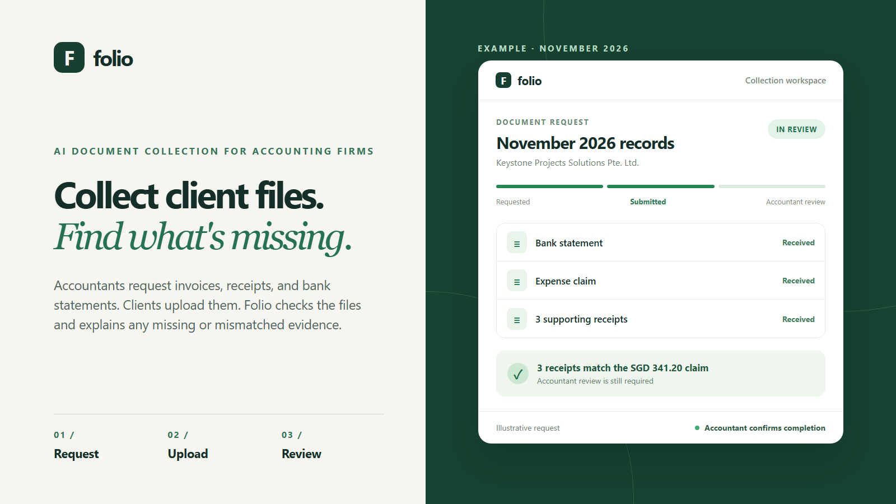
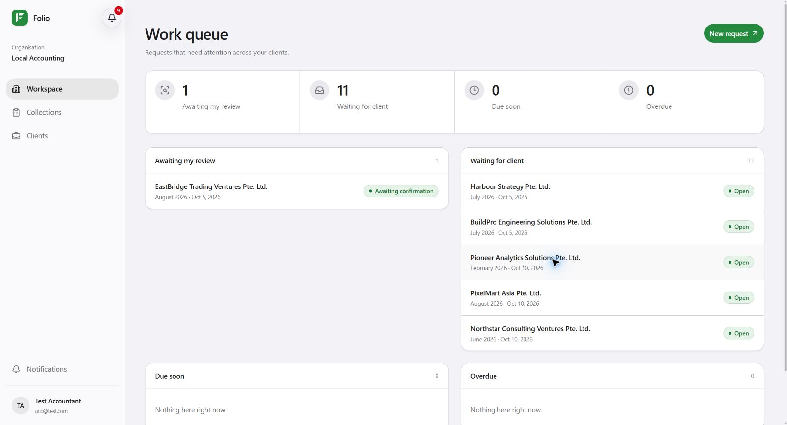
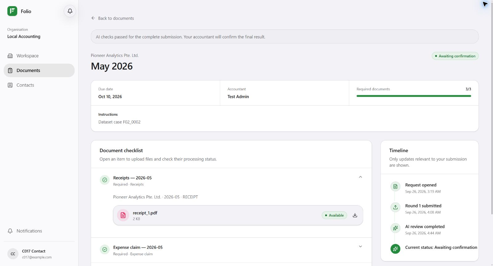
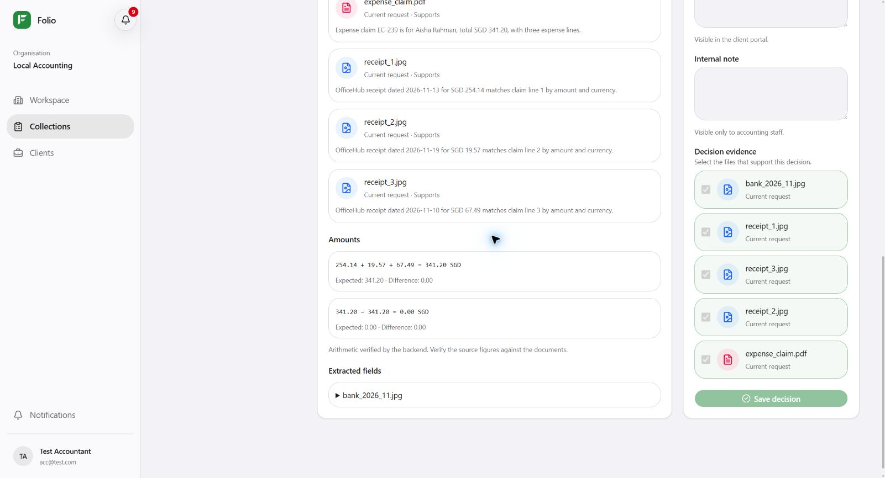
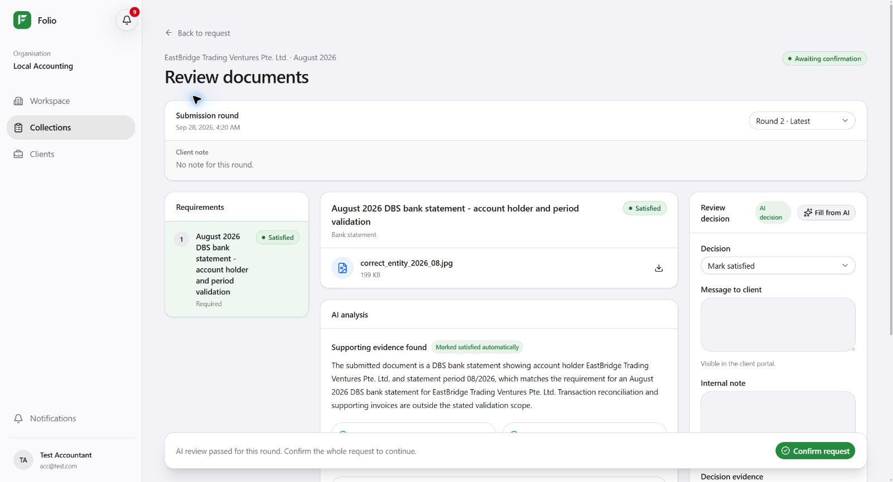

<p align="center">
  
</p>

<h1 align="center">Folio</h1>
<p align="center"><strong>AI-assisted document collection and review for accounting firms.</strong></p>
<p align="center">
  <a href="https://folio.sarl">Live demo</a> ·
  <a href="#product-capabilities">Features</a> ·
  <a href="#demo-files">Demo files</a> ·
  <a href="#source-code">Source code</a>
</p>

Folio gives accounting firms and their clients one place to request, submit, check, and follow up on financial documents. AI helps classify files and review supporting evidence; the backend validates its proposals, and an accountant confirms the overall request.

## Product capabilities

Screenshots below are from synthetic demonstration requests in the live client and accountant workspaces.

### Structured requests for each accounting period

A firm can define exactly which records it needs from each client: document types, required or optional items, due date, instructions, and a responsible accountant. Requests move from draft to published, can be copied into a new month, and appear in a work queue so the firm can see what is waiting on clients or staff.



*The accountant work queue separates requests awaiting review from those waiting for a client.*

### A client portal built around the checklist

Clients see their outstanding requests, upload PDFs or images against the relevant items, and follow progress without searching through email threads. Mixed batches can be sorted into suggested document categories before submission; clients can inspect and correct that placement. Each submission, comment, and correction stays linked to the same request.



*A client request keeps the document checklist and submission timeline together. The displayed AI status is an example of the workflow, not an accuracy claim.*

### Document understanding before and after submission

After a safe upload, Folio's AI suggests a document type and the checklist item it belongs to. That quick classification is only for placement. Once the client submits, a separate review reads the documents and checks details such as legal entity, accounting period, amounts, and references.

### Accounting evidence checks

Folio looks beyond a single file. It can compare a bank payment with invoices or a loan statement, check an expense claim against its original receipts, and look for related records from the current or an earlier period. The backend verifies important monetary relationships before an automatic item decision is applied.



*In the expense-claim example, three receipts total SGD 341.20; the review also compares that amount with the bank payment.*

### Specific follow-up across multiple rounds

When evidence is missing or mismatched, the request identifies the affected item and tells the client what to provide next. A later upload continues the same request with its earlier files and findings intact. If an automatic return appears wrong, an eligible client can request human review without uploading identical files again.

### Accountant oversight and an auditable record

Accountants can open the original documents, inspect the AI's explanation and cited evidence, make or override item decisions, and waive an item with a reason. Folio keeps the review history and in-app notifications, while the overall request requires human confirmation before it is ready for bookkeeping.



*The accountant can review the source and AI analysis, record a decision, and confirm the whole request.*

## Explore the live demo

Visit **[folio.sarl](https://folio.sarl)** with a shared demonstration account:

| Workspace | Email | Password |
| :--- | :--- | :--- |
| Accountant | `acc@test.com` | `test12345678` |
| Firm administrator | `admin@test.com` | `test12345678` |
| Client | `cxxx@test.com` | `FolioDemo123!` |

For the client login, replace `xxx` with the company ID: `C004` → `c004@test.com`. The client account must belong to the same company as the request. The [sample files](sample-files/README.md) provide two synthetic scenarios to explore; demo accounts and data are shared.

## Demo files

The [`sample-files` guide](sample-files/README.md) includes two small, synthetic scenarios with PDF and JPEG documents:

| Scenario | What it demonstrates | Files |
| :--- | :--- | :--- |
| [Loan repayment](sample-files/loan-reconciliation/) | A bank debit compared with correct and incorrect loan statements | 3 PDFs |
| [Employee expense claim](sample-files/expense-claim/) | A multilingual claim, bank payment, and three original receipts | 2 PDFs + 4 JPEGs |

Each scenario lists the matching company, period, upload order, and amounts in the [usage notes](sample-files/README.md). AI results can vary; these files demonstrate the workflow, not a measured accuracy claim.

## Source code

Folio's application is split into three independently maintained repositories. **This repository** holds the project overview and demo materials.

| Component | Repository | Responsibility |
| :--- | :--- | :--- |
| Web app | [acc-system-frontend](https://github.com/multi-mind-nus/acc-system-frontend) | Vue 3 firm and client workspaces |
| Business service | [acc-system-backend](https://github.com/multi-mind-nus/acc-system-backend) | FastAPI, authorization, workflow state, worker, and deployment |
| AI service | [acc-system-agent](https://github.com/multi-mind-nus/acc-system-agent) | File reading, OCR, classification, and structured review |

PostgreSQL stores business records and worker leases. Redis holds revocable session and rate-limit state. The Agent cannot directly change business state; the backend checks searches, evidence, and monetary relationships before applying an allowed decision.

<details>
<summary><strong>Run the stack locally</strong></summary>

Clone the three repositories side by side. Docker is required; see the [backend deployment guide](https://github.com/multi-mind-nus/acc-system-backend/blob/main/deploy/README.md) for configuration details.

```bash
git clone https://github.com/multi-mind-nus/acc-system-backend.git
git clone https://github.com/multi-mind-nus/acc-system-frontend.git
git clone https://github.com/multi-mind-nus/acc-system-agent.git
cd acc-system-backend
cp deploy/.env.example deploy/.env.prod
```

In `deploy/.env.prod`, set `ENVIRONMENT=development` and replace the example PostgreSQL, Redis, JWT, and bootstrap passwords. Keep the database and Redis URLs consistent with those passwords. The default disabled Agent providers allow manual review; AI review requires the provider settings in the [Agent README](https://github.com/multi-mind-nus/acc-system-agent#remote-provider-configuration).

```bash
docker build -t acc-system-backend:local .
docker build -t acc-system-nginx:local deploy/nginx
docker build -t acc-system-agent:local ../acc-system-agent
docker build -t acc-system-frontend:local ../acc-system-frontend
docker compose --env-file deploy/.env.prod -f deploy/compose.yml up -d
docker compose --env-file deploy/.env.prod -f deploy/compose.yml --profile tools run --rm bootstrap
```

Open `http://localhost` and sign in with the bootstrap account configured locally. The public demo credentials above do not apply to a new local installation.

</details>

## Project deliverables

| Deliverable | Availability |
| :--- | :--- |
| Business Proposal | Final PDF will be added here when complete. |
| Technical Document | Final PDF will be added here when complete. |
| YouTube demonstration | Video link will be added here after recording. |

<!-- Add final PDFs under docs/ and replace the rows above with links; add the YouTube URL when ready. -->

## Team

**Multi-Mind · Team Code X898L7U7**

Shu Zixuan · Yao Xinyan · Hu Chengcheng · Liu Mingda
